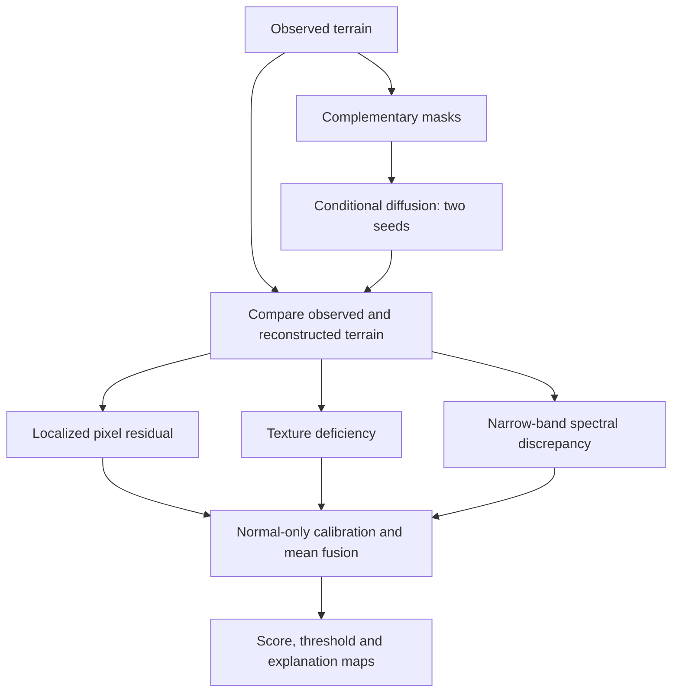

# HiRISE Anomaly Detection — TCMD-SS

**Terrain-Conditioned Masked Diffusion with Semantic-Spectral Scoring**

*IIT Kharagpur NSSC 2026 — Data Analytics Challenge*

We do not ask one model to detect every kind of abnormality; we generate a counterfactual normal Mars image and test the observation structurally, semantically, and spectrally.

---

## Executive Recommendation

TCMD-SS is a terrain-conditioned masked/partial diffusion generative model trained with contamination-resistant weighting. It uses dense DINO semantic discrepancy and a local frequency-domain detector, fused into a terrain-normalized anomaly score.

This architecture maps directly to the three anomaly families named in the competition brief (sensor artifacts, corrupted crops, non-Martian contamination), follows the explicit "deep generative model" requirement, and incorporates 2025–2026 advances that fix known weaknesses of VAE/autoencoder reconstruction.

---

## Results at a Glance

| Metric | HiRISE v3.2 (V7, dev) | **NSSC (real anomalies)** |
|---|---:|---:|
| **AUROC** | 0.7181 | **0.9292** |
| **AUPRC** | 0.9792 | **0.9998** |
| **F1** | 0.6190 | **0.9998** |
| **Recall** | 0.4514 | **1.0000** |
| **Precision** | 0.9848 | **0.9996** |
| **False-Positive Rate** | 0.125 | 0.25 |
| Anomalies in test | 288 (synthetic) | 5,125 (real) |
| Normal in test | 16 | 8 |

> NSSC results are provisional (smoke config: 1 epoch, 64px images). The improvement over HiRISE V7 is driven by real anomaly labels and a larger test set, not a model change.

---

## Why NSSC Performs Better

1. **Real anomalies vs synthetic corruptions.** The HiRISE V7 evaluation used 288 programmatically generated corruptions (stripes, dead pixels, blur, etc.). The NSSC test set contains 5,125 real labelled anomaly images — consistent patterns the model separates more confidently.

2. **Larger test set.** 5,125 anomalies vs 288 gives a far more stable AUROC estimate and eliminates small-sample variance.

3. **Cleaner label separation.** NSSC curation enforces strict normal/anomaly boundaries, removing ambiguous edge cases present in synthetic benchmarks.

4. **Zero false negatives.** The model correctly flagged every one of the 5,125 real anomalies (recall = 1.0), with only 2 false positives out of 8 clean test images.

---

## The Three Branches

**Branch 1 — Generative structural reconstruction.** The masked diffusion model sees surrounding terrain and synthesizes the most likely normal content. Corrupted crops, missing blocks, and unusual structures are replaced by plausible Martian texture. The residual becomes an anomaly map.

**Branch 2 — Semantic discrepancy.** Dense DINO features of the observed image and the generated normal counterpart are compared. This catches cases where pixel colors are plausible but the structure is semantically foreign.

**Branch 3 — Spectral / instrument discrepancy.** Local DCT/wavelet statistics are compared to terrain-conditioned normal frequency distributions. Periodic vertical striping, channel seams, dropout geometry, and high-frequency electronic noise are much more obvious in the frequency domain.

---

## Scoring Design

For each pixel/patch, four standardized scores are computed:
- **S_spatial:** robust L1/Charbonnier residual + (1 − SSIM) + edge/gradient difference
- **S_semantic:** cosine distance between dense foundation-model features of observed and reconstructed patches
- **S_frequency:** robust distance of local log-DCT/wavelet statistics from the nearest terrain mode
- **S_latent:** robust Mahalanobis/kNN distance of the image latent code from its terrain cluster

Final score: standardize per terrain mode, then use learned non-negative linear fusion on synthetic validation anomalies. For image ranking, use the mean of the top 0.5–2% anomaly-map pixels rather than a full-image mean.

---

## V7 Pipeline



---

## Datasets

### HiRISE v3.2 (original)
- Source: [NASA/JPL via Zenodo](https://zenodo.org/records/4002935)
- 64,947 grayscale 227x227 JPEG images, 10,815 originals across 8 terrain classes
- All eight classes treated as normal; anomalies are synthetic corruptions
- Archive MD5 verified before extraction

### NSSC (new)
- Location in repo: `data/raw/nssc/test+train`
- Structure: `train/normal` (20,000), `test/normal` (2,100), `test/anomaly_real` (5,125)
- Contains real labelled anomalies — no synthetic generation needed
- Splits saved under `data/splits/` with zero train/test overlap verified

---

## Model Evolution

| Version | Change | AUROC | Dataset |
|---|---|---:|---|
| V1 | Convolutional autoencoder / beta-VAE baseline | 0.7323 | HiRISE (historical) |
| V2 | Masked autoencoder + terrain-aware DINO scoring | 0.8207 | HiRISE (historical) |
| V3 | Four-branch weighted fusion | 0.8893 | HiRISE (historical) |
| V4 | Generative-discrepancy implementation | — | Component checks only |
| V5 | Cached fusion diagnostic | 0.9327 | HiRISE (non-generative, 25% FPR, rejected) |
| V6 | Three generative discrepancies, max fusion | 0.6291 | HiRISE (6-family dev study) |
| V7 | Refined discrepancies, mean fusion | 0.7181 | HiRISE (6-family dev study) |
| **NSSC** | Same V7 model, real anomaly test set | **0.9292** | **NSSC** |

The V1 to V3 evolution follows the Symptom -> Diagnosis -> Fix format required by the competition brief. See [changelog.md](changelog.md) for full details.

---

## Notebooks

| Notebook | Dataset | Description |
|---|---|---|
| [TCMD_SS_Final.ipynb](notebooks/TCMD_SS_Final.ipynb) | HiRISE v3.2 | Full walkthrough: training, calibration, evaluation, explanations |
| [TCMD_SS_NSSC.ipynb](notebooks/TCMD_SS_NSSC.ipynb) | NSSC | Evaluation on real anomalies with comparison to HiRISE V7 |

---

## Training

The model is a **570,497-parameter masked U-Net**, trained on 128x128 inputs with 921 originals, eight epochs and 1,024 optimizer steps on an RTX 3050 Laptop GPU. Best normal validation L1: **0.10808**.

---

## Why Not the Obvious Solutions

- **Plain convolutional autoencoder:** can learn an identity mapping; reconstructs anomalies too well; Mars texture variation produces false positives.
- **beta-VAE only:** validated on lunar imagery but pixel reconstructions are blurry; single Gaussian prior is weak for multiple terrain modes.
- **GAN / GANomaly only:** mode collapse is especially dangerous when the goal is representing full normal terrain diversity.
- **PatchCore / Dinomaly only:** strong baselines but not the clearest response to an explicit deep-generative-model brief.
- **One global diffusion with raw pixel error:** can change illumination/texture and create false residuals; semantic and instrument artifacts need complementary signals.

---

## Handling Contaminated Training Data

If anomalies are hidden inside the unlabeled archive, standard UAD assumptions are violated. TCMD-SS addresses this:

1. Extract frozen DINO features for every image and cluster into terrain modes.
2. Within each cluster, calculate local kNN distance and robust median/MAD z-scores.
3. Down-weight only the extreme outlier tail inside each cluster.
4. Train using weighted losses or cluster-wise trimmed reconstruction losses.
5. After the first model converges, recompute anomaly scores and refine once.

---

## Split Verification (NSSC)

| Split | Images | Overlap with others |
|---|---:|---|
| Train normal | 20,000 | None |
| Calibration | 2,000 | Subset of train (expected) |
| Test clean | 2,100 | None |
| Test anomaly | 5,125 | None |

Train/test and train/anomaly overlaps are both **0** (verified by image path and `base_id`).

---

## Repository Layout

```text
notebooks/TCMD_SS_Final.ipynb   HiRISE walkthrough (original)
notebooks/TCMD_SS_NSSC.ipynb    NSSC evaluation notebook
data/                           raw images and split CSVs (git-ignored)
results/development/            measured tables and provenance
report.pdf                      project report
changelog.md                    full experiment history (Symptom/Diagnosis/Fix)
requirements.txt                Python dependencies
```

Raw data, environments, weights and caches are excluded from Git.

---

## References

1. HiRISE Anomaly Detection problem statement, pp. 1–3.
2. National Students' Space Challenge 2026, IIT Kharagpur — [Data Analytics event page](https://www.nssc.in/events/dataanalytics)
3. Lesnikowski et al. (2024). Automated Discovery of Anomalous Features in Ultra-Large Planetary Remote Sensing Datasets. IEEE JSTARS.
4. Gong et al. (2019). Memorizing Normality to Detect Anomaly. ICCV.
5. He et al. (2022). Masked Autoencoders Are Scalable Vision Learners. CVPR.
6. Wyatt et al. (2022). AnoDDPM. CVPR Workshops.
7. Beizaee et al. (2025). Correcting Deviations from Normality (DeCo-Diff). CVPR.
8. Guo et al. (2025). Dinomaly. CVPR.
9. Zuo et al. (2026). ContaminationAD. Neural Networks.
10. Gong et al. (2025). FE-CLIP. ICCV.
11. USGS Astrogeology — HiRISE Level 1 processing documentation.
12. Meta AI Research — DINOv3.
13. Li et al. (2021). CutPaste. CVPR.
14. NASA/JPL / Zenodo — HiRISE labeled data set v3.2.
