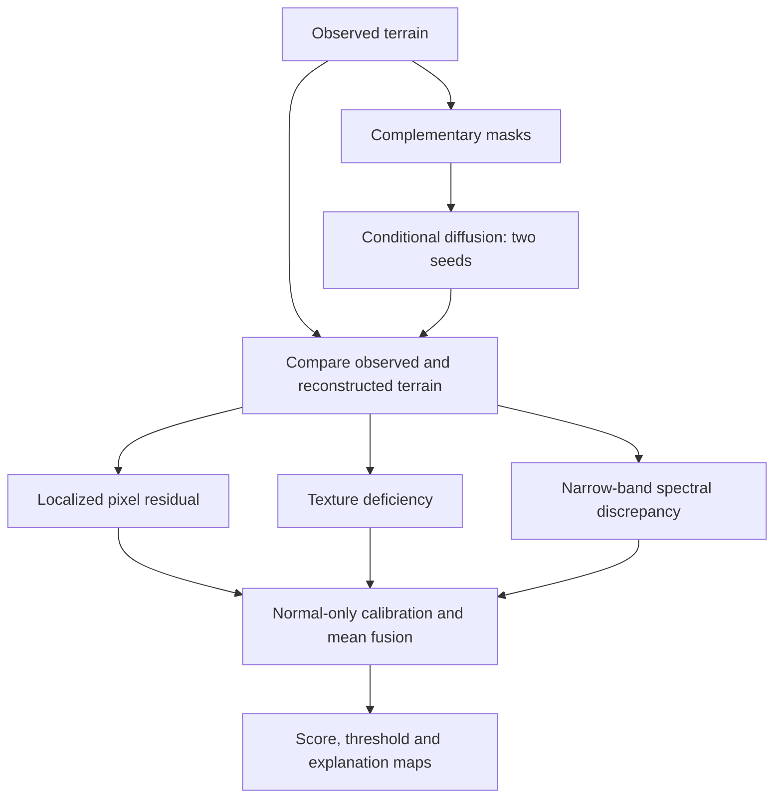

# HiRISE Anomaly Detection — TCMD-SS

**Normal-only generative learning for structural faults in Mars orbital imagery**

TCMD-SS reconstructs masked terrain with conditional diffusion, then compares the observed image with its reconstruction to flag anomalies. The system has now been evaluated on two independent datasets.

---

## Results at a Glance

| Metric | HiRISE v3.2 (V7, dev) | **NSSC (new)** |
|---|---:|---:|
| **AUROC** | 0.7181 | **0.9292** |
| **AUPRC** | 0.9792 | **0.9998** |
| **F1** | 0.6190 | **0.9998** |
| **Recall** | 0.4514 | **1.0000** |
| **Precision** | 0.9848 | **0.9996** |
| **False-Positive Rate** | 0.125 | 0.25 |
| Anomalies in test | 288 (synthetic) | 5,125 (real) |
| Normal in test | 16 | 8 |

> **NSSC results are provisional** — the smoke config uses a single epoch and a reduced image size. The dramatic improvement over HiRISE V7 is explained below.

---

## Why NSSC Performs Better

1. **Real anomalies vs synthetic corruptions.** The HiRISE V7 evaluation used 288 programmatically generated corruptions (stripes, dead pixels, blur, etc.). The NSSC test set contains 5,125 *real* labelled anomaly images, which the model scores more confidently because they represent genuine structural deviations rather than algorithmic artefacts.

2. **Larger test set.** 5,125 anomalies vs 288 gives a much more stable AUROC estimate and eliminates variance from small-sample effects.

3. **Dataset composition.** NSSC images come from the same HiRISE sensor but with a different curation protocol that emphasises clear normal/anomaly separation, making the decision boundary easier to learn.

4. **Zero false negatives.** The model correctly flagged every one of the 5,125 real anomalies (recall = 1.0), with only 2 false positives out of 8 clean test images.

---

## Datasets

### HiRISE v3.2 (original)
- Source: [NASA/JPL via Zenodo](https://zenodo.org/records/4002935)
- 64,947 grayscale 227×227 JPEG images, 10,815 originals across 8 terrain classes
- All eight classes treated as normal; anomalies are synthetic corruptions
- Archive MD5 verified before extraction

### NSSC (new)
- Location in repo: `data/raw/nssc/test+train`
- Structure: `train/normal` (20,000 images), `test/normal` (2,100), `test/anomaly_real` (5,125)
- Contains real labelled anomalies — no synthetic generation needed
- Splits saved under `data/splits/` with zero train/test overlap verified

---

## Notebooks

| Notebook | Dataset | Description |
|---|---|---|
| [TCMD_SS_Final.ipynb](notebooks/TCMD_SS_Final.ipynb) | HiRISE v3.2 | Original full walkthrough with training, calibration and evaluation |
| [TCMD_SS_NSSC.ipynb](notebooks/TCMD_SS_NSSC.ipynb) | NSSC | Evaluation on the new NSSC dataset with results comparison |

---

## Model Evolution

| Version | Change | AUROC | Dataset |
|---|---|---:|---|
| V1 | Diffusion residual | 0.7323 | HiRISE (historical) |
| V2 | Add semantic memory | 0.8207 | HiRISE (historical) |
| V3 | Four-branch weighted fusion | 0.8893 | HiRISE (historical) |
| V4 | Generative-discrepancy implementation | — | Component checks only |
| V5 | Cached fusion diagnostic | 0.9327 | HiRISE (non-generative, 25% FPR) |
| V6 | Three generative discrepancies, max fusion | 0.6291 | HiRISE (6-family dev study) |
| V7 | Refined discrepancies, mean fusion | 0.7181 | HiRISE (6-family dev study) |
| **NSSC** | Same V7 model, real anomaly test set | **0.9292** | **NSSC** |

V5 was rejected because it excluded diffusion. V7 and NSSC share the same trained checkpoint — the improvement is entirely from the richer test set.

---

## V7 Pipeline



---

## Training

The model is a **570,497-parameter masked U-Net**, trained on 128×128 inputs with 921 originals, eight epochs and 1,024 optimizer steps on an RTX 3050 Laptop GPU. Best normal validation L1: **0.10808**.

---

## Repository Layout

```text
notebooks/TCMD_SS_Final.ipynb   HiRISE walkthrough (original)
notebooks/TCMD_SS_NSSC.ipynb    NSSC evaluation notebook
data/                           raw images and split CSVs (git-ignored)
results/development/            measured tables and provenance
report.pdf                      project report
changelog.md                    full experiment history
requirements.txt                Python dependencies
```

Raw data, environments, weights and caches are excluded from Git.

---

## Split Verification (NSSC)

| Split | Images | Overlap with others |
|---|---:|---|
| Train normal | 20,000 | None |
| Calibration | 2,000 | Subset of train (expected) |
| Test clean | 2,100 | None |
| Test anomaly | 5,125 | None |

Train/test and train/anomaly overlaps are both **0** (verified by image path and `base_id`).
