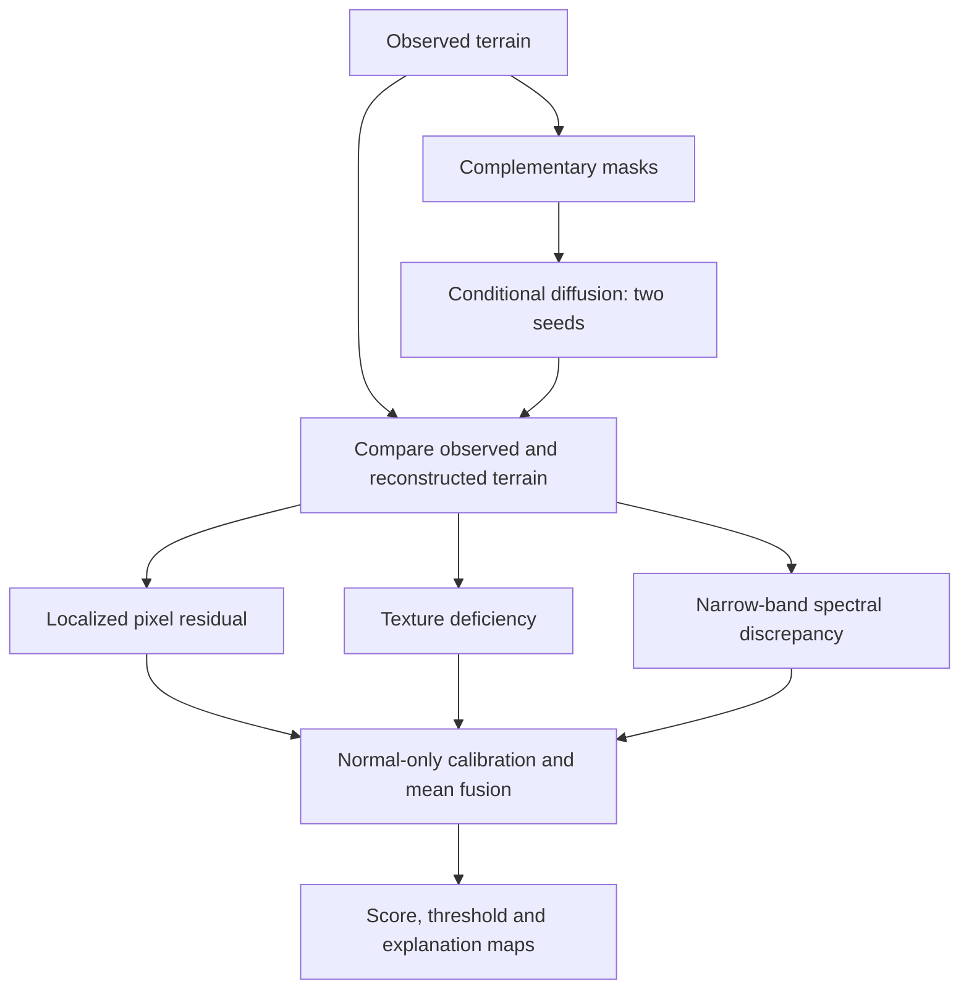

# HiRISE Anomaly Detection — TCMD-SS

**Normal-only generative learning for structural faults in Mars orbital imagery**

TCMD-SS reconstructs masked terrain with conditional diffusion and compares the observed image with its reconstruction. All eight HiRISE terrain classes are treated as normal.

> **Latest development candidate: V7 — AUROC 0.7181, recall 45.14%, clean false-positive rate 12.5%.** Final holdout evaluation remains pending.

[Full notebook](notebooks/TCMD_SS_Final.ipynb) · [Report](report/TCMD_SS_Report.pdf) · [Model evolution](MODEL_EVOLUTION.md) · [Run instructions](TECHNICAL_WORKFLOW.md)

## Notebook

[TCMD_SS_Final.ipynb](notebooks/TCMD_SS_Final.ipynb) covers the dataset, model, training, calibration and evaluation. It includes saved results and a live reconstruction demo. See [setup instructions](notebooks/README.md) for Kaggle or Colab.

## Model evolution

| Version | Change | AUROC | Evaluation context |
|---|---|---:|---|
| V1 | Diffusion residual | 0.7323 | Historical benchmark |
| V2 | Add semantic memory | 0.8207 | Historical benchmark |
| V3 | Four-branch weighted fusion | 0.8893 | Historical benchmark |
| V4 | Generative-discrepancy implementation | — | Component checks; no detection score |
| V5 | Cached fusion diagnostic | 0.9327 | Non-generative diagnostic; 25% FPR |
| V6 | Three generative discrepancies, max fusion | 0.6291 | Six-family development study |
| V7 | Refined discrepancies, mean fusion | **0.7181** | Six-family development study |

These versions reuse one trained checkpoint. The historical and six-family benchmarks are not directly comparable. V5 was rejected because it excluded diffusion and had a 25% false-positive rate. Details are in [MODEL_EVOLUTION.md](MODEL_EVOLUTION.md).

## Development results

V7 uses **16 clean development originals from 12 observations**, plus **288 synthetic corruptions** covering six families and three severities. Two independent sets of 64 clean images provide score calibration and the 95th-percentile threshold.

| Metric | V7 |
|---|---:|
| AUROC | 0.7181 |
| AUPRC | 0.9792 |
| Precision | 0.9848 |
| Recall | 0.4514 |
| F1 | 0.6190 |
| Clean false-positive rate | 0.1250 |
| Threshold | 0.698651 |

| Actual / predicted | Normal | Anomaly |
|---|---:|---:|
| Normal | 14 | 2 |
| Anomaly | 158 | 130 |

[Scores](results/development/generative_v7/summary.json) · [Predictions](results/development/generative_v7/predictions.csv). These synthetic development results were used for model selection. Precision and AUPRC reflect the high anomaly prevalence.

## V7 pipeline



V7 averages the three calibrated scores. DINO is not included.

## Training snapshot

Training used a **570,497-parameter masked U-Net**, 128×128 inputs, 921 training originals, eight epochs and 1,024 optimizer steps on an RTX 3050 Laptop GPU. Best measured normal validation L1 was **0.10808**, scored on eight images. [Training evidence](outputs/diffusion/training_summary.json).

## Dataset and leakage control

The official [NASA/JPL HiRISE v3.2 dataset](https://zenodo.org/records/4002935) contains **64,947 grayscale 227×227 JPEG images**, including 10,815 originals. The archive MD5 was verified.

Rotations, flips and brightness variants stay grouped by original landmark. Experimental splits also respect source observations and conservative near-duplicate links. The supplied split is retained for auditing. See the [audit report](outputs/dataset_audit_report.md) and [split protocol](results/development/split_protocol.json).

## Explainability and failures


[Six measured examples](results/figures/generative_v7) cover dead pixels, stripes, missing patches, local blur, patch duplication and foreign content. Copy-move and foreign-content localization remain weak.

## Repository layout

```text
notebooks/TCMD_SS_Final.ipynb  complete executed walkthrough
src/                         reusable data and model implementations
scripts/                     audit, training and evaluation commands
configs/                     experiment settings
tests/                       data, protocol and scoring checks
results/development/         measured tables and provenance
results/figures/             explanation figures
report/                      PDF and editable report
MODEL_EVOLUTION.md           experiment history
TECHNICAL_WORKFLOW.md         detailed historical commands
```

Raw data, environments, weights and caches are excluded from Git. Replay requires the local evidence files described in the notebook. See [licensing status](LICENSE.md).

## Reproduce and review

```bash
python scripts/build_walkthrough_notebook.py
python -m unittest tests.test_revision tests.test_discrepancy tests.test_cached_fusion -v
```

All 82 notebook code cells passed in review mode. Full test collection and DINO imports are blocked by Windows Application Control on the local machine. [Validation record](results/development/walkthrough_validation.json).

Next steps: expand clean calibration, complete development validation and evaluate the frozen model on the reserved final set.
