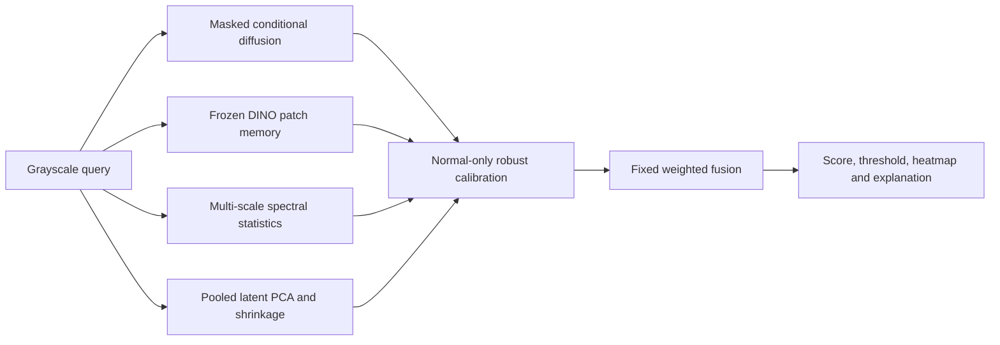

> Latest generative experiment: V6/V7 tested six corruption families on consumed development images. V7 AUROC **0.7181**, TPR **45.14%**, FPR **12.5%**; DINO and final evaluation remain pending. See [latest status](results/development/revision_status_latest.json) and [project defence guide](PROJECT_DEFENCE.md). These scores are not comparable to the historical stronger-corruption benchmark.

> Submission artifacts: [executed notebook](notebooks/TCMD_SS_Final.ipynb), [development report](report/TCMD_SS_Report.pdf), [editable report](report/TCMD_SS_Report.md), and [readiness checklist](SUBMISSION_CHECKLIST.md). New cached-score ablations are in `results/development/cached_fusion_v5/`. No final evaluation or GitHub publication has occurred.

> Revision status (2026-09-11): the generative-discrepancy revision is incomplete. See [revision status](results/development/REVISION_STATUS.md), [model evolution](MODEL_EVOLUTION.md), and [reserved split protocol](results/development/split_protocol.json). Historical commands below run the independent-expert baseline; they do not run the new candidate. Final holdout remains unevaluated.

# TCMD-SS

The [Kaggle/Colab-style walkthrough](notebooks/TCMD_SS_Final.ipynb) contains 120 cells (82 code and 38 Markdown), with inline implementations, dataset previews, training code, a live reconstruction demo and saved development results. All 82 code cells executed successfully in review mode. Fresh training and full development inference are disabled by default; attach the dataset, checkpoint and project evidence before replaying on another machine. Rebuild with `python scripts/build_walkthrough_notebook.py`; previous notebook versions are archived automatically.

**Terrain-Conditioned Masked Diffusion with Semantic-Spectral Scoring** is an
unsupervised deep generative system for structurally abnormal Martian imagery.
All clean HiRISE terrain classes 0-7 are NORMAL. Craters, dunes, slope streaks,
ejecta, swiss cheese and spiders are never relabeled as anomalies.



## Environment

Python 3.12+ is required. The recorded local environment uses Windows and Python
3.14. A CPU smoke run is supported. For GPU execution install a CUDA-enabled
PyTorch build appropriate to the hardware before the remaining requirements.

```powershell
python -m venv .venv
# CPU/general installation:
.\.venv\Scripts\python -m pip install -r requirements.txt
# CUDA 12.8 build used on this machine:
.\.venv\Scripts\python -m pip install torch==2.11.0+cu128 torchvision==0.26.0+cu128 --index-url https://download.pytorch.org/whl/cu128
```

`requirements-lock.txt` records the actual installed environment. CUDA wheel URLs
are platform-specific; consult https://pytorch.org/get-started/locally/ for another
machine. This machine has an RTX 3050 Laptop GPU with 4 GB VRAM and about 15.7 GB
system RAM. It originally had CPU-only PyTorch; CUDA was installed for this task.

## Dataset and preserved audit

The original [NASA/JPL HiRISE v3.2 dataset](https://zenodo.org/records/4002935) is
already downloaded in `data/raw/hirise-map-proj-v3_2.zip` and extracted under
`data/raw/hirise_v3_2/`. Verified MD5: `236d9c627db1a5970e77a01a8c8a035a`.
The previous full audit is preserved, including its CSV, JSON, class distribution,
base groups and checksum verification. This continuation does not re-audit or
reuse an f-AnoGAN notebook.

`create_unsupervised_split.py` reuses the audited custom allocation. Every base ID,
source observation, duplicate/pHash component and source splitting group stays
whole. All classes are normal. The resulting manifests contain 39,997 training
images, 2,377 calibration originals and 1,609 clean test originals. Small runs use
one original per base and deterministic semantic-class coverage; class labels do
not enter anomaly learning. The image split proportions differ from the 70/15/15
safe-group targets because group sizes differ.

```powershell
.\.venv\Scripts\python scripts/create_unsupervised_split.py
# Only if the original audit must deliberately be regenerated:
.\.venv\Scripts\python scripts/audit_dataset.py
```

For a fresh checkout, download the same official archive with curl, then run
`scripts/extract_dataset.py` (MD5 check precedes extraction) and the audit script.
See `outputs/dataset_audit_report.md` for the original audit findings. Do not run
training until the audit outputs and split manifests exist.

## Pretrained backbones

Smoke uses the public pretrained `vit_small_patch16_224.dino` checkpoint.
Full configuration supports `vit_large_patch16_dinov3.sat493m` through timm.
No randomly initialized network is silently used as a semantic substitute.
`configs/local.yaml` records the backbone actually selected for the bounded run.

```powershell
New-Item -ItemType Directory -Force outputs/semantic/weights
curl.exe -L --fail --retry 3 -o outputs/semantic/weights/dino_small.safetensors https://huggingface.co/timm/vit_small_patch16_224.dino/resolve/main/model.safetensors
curl.exe -L --fail --retry 3 -o outputs/semantic/weights/dino_satellite.safetensors https://huggingface.co/timm/vit_large_patch16_dinov3.sat493m/resolve/main/model.safetensors
```

The full configuration can download its pretrained model through timm when
`dino_weights` is null. A local safetensors path avoids network access afterward.
Read the original model cards and license terms before redistributing weights.

## Reproduce the end-to-end experiment

```powershell
.\.venv\Scripts\python -m pytest -q
.\.venv\Scripts\python -m compileall -q src scripts tests
.\.venv\Scripts\python scripts/run_pipeline.py --config configs/smoke.yaml
.\.venv\Scripts\python scripts/run_pipeline.py --config configs/local.yaml
# Full-scale planned configuration; requires substantially more compute:
.\.venv\Scripts\python scripts/run_pipeline.py --config configs/full.yaml
```

The orchestration order is split, diffusion training, semantic memory, spectral/
latent fitting, NORMAL calibration, test corruption generation, evaluation and
ablations. Generated anomalies are never inputs to any fitting/calibration stage.
Full training is not claimed merely because the full configuration exists.

Individual stages are also executable:

```powershell
.\.venv\Scripts\python scripts/train_diffusion.py --config configs/local.yaml
.\.venv\Scripts\python scripts/build_semantic_memory.py --config configs/local.yaml
.\.venv\Scripts\python scripts/fit_normal_models.py --config configs/local.yaml
.\.venv\Scripts\python scripts/calibrate_scores.py --config configs/local.yaml
.\.venv\Scripts\python scripts/create_test_anomalies.py --config configs/local.yaml
.\.venv\Scripts\python scripts/evaluate_tcmdss.py --config configs/local.yaml
.\.venv\Scripts\python scripts/run_ablation.py --config configs/local.yaml
```

To resume, increase `epochs` in the SAME architecture/subset configuration first.
It means the total requested epochs, not extra epochs. Then run:

```powershell
.\.venv\Scripts\python scripts/train_diffusion.py --config configs/local.yaml --resume outputs/diffusion/checkpoints/last.pt
# For a full run, after its initial checkpoint exists:
.\.venv\Scripts\python scripts/train_diffusion.py --config configs/full.yaml --resume outputs/full/diffusion/checkpoints/last.pt
```

Checkpoints include optimizer/scaler and random states. Resume checks architecture
and training base IDs. Select `best.pt` by normal validation reconstruction; the
validation sources are drawn only from the training partition. Recalibrate after
changing a checkpoint or fitted model. Evaluation rejects stale model hashes or
configuration. Local and full architectures cannot resume each other's checkpoints.

## Model and calibration details

The compact GroupNorm residual U-Net has channel multipliers 1/2/4, timestep
embeddings and visible grayscale context. It denoises 10-40% rectangle, multi-region
and irregular masks. No hidden original pixels are supplied to its context input.
Cosine noise scheduling and deterministic eta=0 DDIM are implemented. Four masking
patterns cover every pixel, and reconstruction L1 yields the generative signal.
Floating-point batch/hardware differences may remain despite fixed sampling noise.

Frozen DINO patch tokens are normalized, sampled equally across normal base images
into a capped memory, and compared with chunked k=5 cosine similarity. The top 5%
patch scores define semantic normality. The spectral branch uses FFT-band and
directional statistics in 8/16/32-pixel windows. Latent normality uses pooled DINO
features, NumPy PCA and fixed 0.1 covariance shrinkage. No anomaly samples fit them.

Each branch uses positive robust z scores from normal calibration medians/MADs.
The fixed fusion is **0.40 diffusion + 0.25 semantic + 0.20 spectral + 0.15 latent**.
The final threshold is the 99th percentile of fused NORMAL calibration scores.
Equal weights, V1/V2/V3 and branch removals are predefined ablations, each with its
own normal-only threshold. No weights are chosen from anomaly benchmark metrics.

## Benchmark, metrics and explanations

Deterministic test-only generators cover stripes/banding, dead lines/pixels,
clipping, blur/noise, missing crops, block permutation, patch duplication, tearing
and synthetic foreign patterns at configured severities. A `foreign_path` setting
can supply a local foreign image. No real foreign-content dataset is claimed here.
Each manifest retains source identity, corruption seed/type/severity, changed
fraction, generated file and change mask. Failed no-change corruptions are retried.

Saved evaluation includes AUROC, AUPRC, F1, precision, recall, specificity, balanced
accuracy, FPR, confusion counts, family/severity results, per-normal-terrain FPR and
base-landmark bootstrap confidence intervals. Actual predictions are retained.
Synthetic prevalence affects AUPRC/F1; results are not real-fault validation.

```powershell
.\.venv\Scripts\python scripts/predict.py --config configs/local.yaml --image "path/to/query.jpg" --output outputs/prediction
```

Explanations show eight panels and actual weighted branch contributions. Latent
normality is global and contributes uniformly to the heatmap; it is not a localized
segmentation prediction. Text describes the largest actual contributions.

## Notebook and PDF

```powershell
.\.venv\Scripts\python scripts/build_submission.py --config configs/local.yaml
.\.venv\Scripts\python scripts/build_report.py --config configs/local.yaml
```

The primary notebook is `TCMD_SS_HiRISE_Anomaly_Detection.ipynb`. It imports reusable
modules and contains outputs from actual kernel execution. By default it displays
saved results rather than retraining. `RUN_TRAINING=True` explicitly enables the
training cell. The report is `report/TCMD_SS_Report.pdf`; editable Markdown source
is retained alongside it. Report numbers are read from saved JSON/CSV files.
`MODEL_EVOLUTION.md` distinguishes actual engineering evidence and nested scoring
versions from independent full training runs.

## Repository structure

```text
configs/                 audit base, smoke, bounded local, full configurations
src/data/                preserved audit helpers, normal protocol and corruptions
src/diffusion/           U-Net, masks, DDIM, training and resume
src/semantic/            frozen DINO and exact chunked memory kNN
src/spectral/            local frequency normality
src/latent/              PCA and shrinkage normality
src/fusion/              normal-only calibration and predefined fusion
src/evaluation/          metrics, grouped bootstrap and explanation figures
scripts/                 stage CLIs, orchestration, prediction and submission builders
tests/                   audit and model/protocol tests
outputs/smoke/           real smoke artifacts
outputs/diffusion/       bounded-run best/last checkpoints and actual history
outputs/semantic/        backbone metadata, normal memory and local weights
outputs/calibration/     normal scores, medians/MADs, thresholds and model hashes
outputs/evaluation/      actual predictions and detection diagnostics
outputs/heatmaps/         labeled panels, raw maps and explanation text
outputs/ablation_results.csv
outputs/ablation_plot.png
report/                  generated PDF and editable source
```

Large archives, images, weights, checkpoints and caches are ignored by Git.
Outputs exist locally and can be selected explicitly for submission; the dataset
must not be redistributed in Git. See `LICENSE.md` for licensing status.

## Limitations

The local run is deliberately bounded and provisional. All public clean terrain
classes are treated as normal under the competition protocol, not certified by a
human contamination review. Corruptions are synthetic; unseen real instrument
faults may behave differently. Calibration tails and class-specific false-positive
rates have small denominators. Source grouping is conservative and may join visually
similar but distinct landmarks. Base-level bootstrap does not remove all within-
observation dependence. GPU memory and runtime limit the full experiment.

Exact hardware, runtime, configuration, completed epochs and metrics are saved in
`outputs/run_summary.json`, `outputs/diffusion/training_summary.json` and the report.
Do not report planned full-run settings as measured results.
