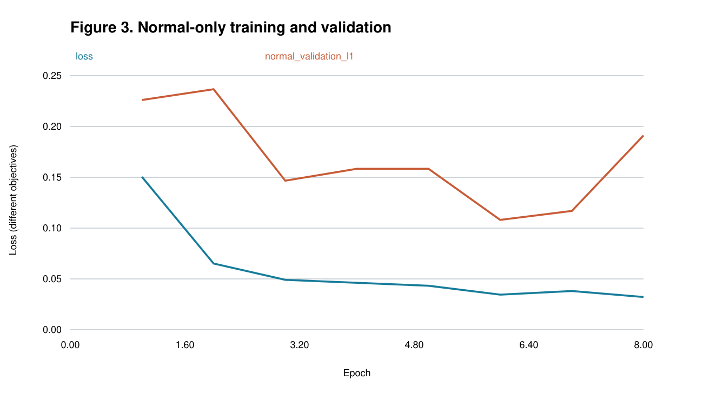
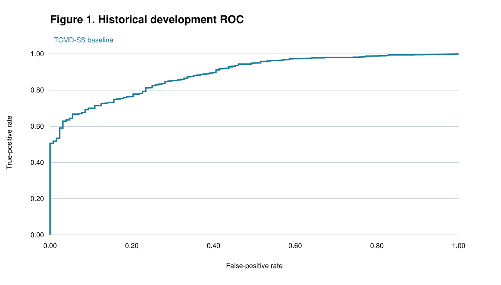
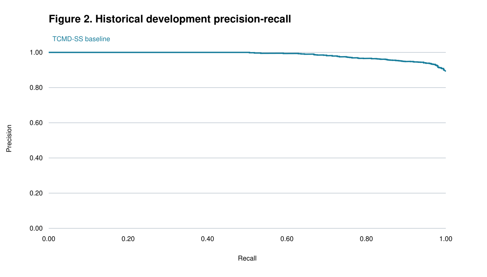
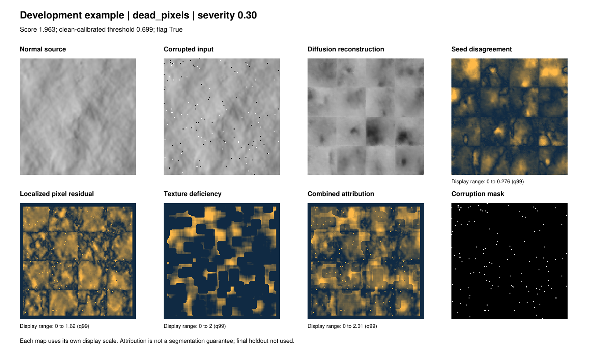
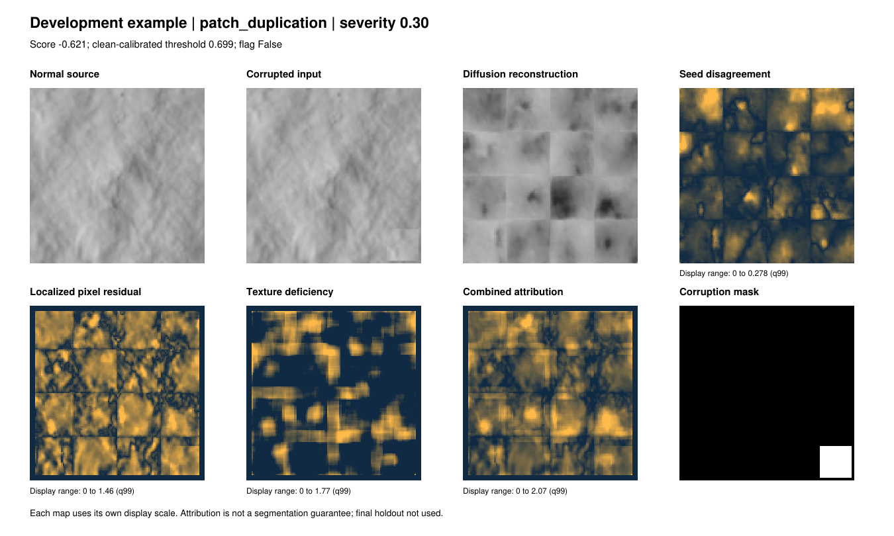

## TCMD-SS | HiRISE anomaly detection

Unsupervised deep generative modeling on Martian surface imagery

Evidence-backed development report. Final holdout NOT evaluated.

I study structural faults in normal Mars imagery using masked conditional diffusion. I compare reconstructed terrain with the observed image and evaluate the resulting anomaly scores and maps. The historical baseline includes independent auxiliary branches. The new three-channel generative discrepancy has now been evaluated on a separate six-family development protocol; its DINO semantic extension remains untested.

| Measured system | AUROC | TPR | Clean FPR |
| --- | --- | --- | --- |
| Historical fixed fusion | 0.8893 | 0.6581 | 5.47% |
| Historical equal-weight ablation | 0.9011 | 0.6458 | 3.91% |
| New cached DINO + spectral (diagnostic only) | 0.9327 | 0.9081 | 25.00% |

The last row excludes diffusion and has unacceptable false positives for the intended use. It is not selected as the competition model. The rows use different normal calibration protocols and must not be presented as controlled proof of one model improving another.

Research scope: the supplied MarsPS practice statement. I treat all eight terrain classes as normal and reserve final evaluation until development is complete. No GitHub publication or official competition submission has occurred.

## 1 | Dataset integrity and experimental separation

Official NASA/JPL HiRISE v3.2: 64,947 grayscale JPEG images, 227 x 227 pixels, 10,815 original landmarks and 232 source observations. Archive MD5 verified: 236d9c627db1a5970e77a01a8c8a035a. Rotations, flips and brightness variants remain grouped with their original.

| Role | Images | Unique bases | Sources |
| --- | --- | --- | --- |
| train_normal | 39997 | 6829 | 158 |
| calibration_a | 1418 | 1418 | 22 |
| calibration_b | 959 | 959 | 19 |
| development | 1538 | 1538 | 30 |
| final_holdout | 71 | 71 | 3 |

No source, base, exact/near-linked group crosses the revised roles. Previously evaluated sources are development. The 71 final originals from three sources remain reserved; their eligibility is based on saved workspace exposure history, not unknown external experiments.

Audit: no exact byte/pixel duplicate groups or corrupt images. Perceptual hashing found 142 cross-base candidate pairs; these include possible false positives. Conservative linked grouping is retained. Only three final sources means high uncertainty and restricted terrain coverage.

## 2 | All semantic terrain classes are normal

| Class ID | Class name | All images | Original images | Augmented images |
| --- | --- | --- | --- | --- |
| 0 | other | 52722 | 8802 | 43920 |
| 1 | crater | 5024 | 794 | 4230 |
| 2 | dark dune | 766 | 166 | 600 |
| 3 | slope streak | 1575 | 267 | 1308 |
| 4 | bright dune | 1654 | 250 | 1404 |
| 5 | impact ejecta | 476 | 74 | 402 |
| 6 | swiss cheese | 1834 | 298 | 1536 |
| 7 | spider | 896 | 164 | 732 |

Terrain labels describe craters, dunes and other legitimate Mars structures. They are not anomaly labels. Training and calibration use clean records only. Synthetic faults are confined to development/stress evaluation.

The historical benchmark has 128 clean images and 1,056 corrupted cases derived from 32 originals. Its 11 corruption kinds use severities 0.2, 0.5 and 0.8. Blur-plus-noise is not a pure local-blur test, and checkerboard contamination is not a representative sample of real foreign imagery.

## 3 | Generative model and scoring methodology

Trained baseline: custom 570,497-parameter grayscale U-Net at 128 x 128. Inputs are noisy hidden pixels, visible context and a mask. Masked noise-prediction MSE uses only normal Mars. Four complementary inference masks reconstruct every pixel while hiding the query region from conditioning.

Eight epochs completed, 1,024 optimizer steps and 4,096 sample presentations. Training pool: 921 originals; normal validation pool: 103, with eight scored for checkpoint selection. Best normal-validation reconstruction MAE: 0.10808. These measurements describe the saved bounded local experiment.

Baseline semantic scores use frozen satellite DINOv3 patch memory; local FFT and global latent distance are separate auxiliary branches. Fixed fusion is 0.40 / 0.25 / 0.20 / 0.15 after robust calibration, with a historical clean 99th-percentile threshold. These independent branches are not the new generative-discrepancy architecture.

Generative revision: observed image -> two-seed masked diffusion -> mean reconstruction and seed disagreement -> pixel, texture and directional spectral discrepancies -> clean-A robust z -> clean-B q95 threshold. Every tested discrepancy references the generator output. The proposed corresponding-patch DINOv2 extension remains blocked and is not included in the reported three-channel scores.

Single clean training-image reconstruction smoke: 15 DDIM steps, seeds 42/1042, 3.35 seconds, residual MAE 0.06196. Seed disagreement is not a calibrated uncertainty interval. The frozen final-run guard is implemented but has not been activated.

## 4 | Normal-only learning curves

Training noise MSE and validation reconstruction MAE have different meanings. The minimum validation reconstruction error occurs at epoch 6; later validation degradation supports preserving the best checkpoint. The scored validation subset is small.

## 5 | Historical baseline results

| Metric | Value |
| --- | --- |
| auroc | 0.8893 |
| auprc | 0.9852 |
| f1 | 0.7907 |
| precision | 0.9900 |
| recall | 0.6581 |
| false_positive_rate | 0.0547 |

AUROC 95% interval: 0.8609-0.9170 from 300 bootstrap resamples of base landmarks. This interval does not account for source-level dependence or architecture selection. AUPRC and precision reflect the artificially high anomaly prevalence (1,056/1,184), not deployment prevalence.

Historical decision threshold: 1.7794. Confusion matrix: TN 121, FP 7, FN 361, TP 695. Saved evaluation time: 1,369.5 seconds / 1,184 cases = 1.16 seconds per case, including scoring overhead. This is not a controlled production-latency benchmark.

## 6 | ROC: threshold-independent ranking

## 6 | Precision-recall: benchmark prevalence matters

## 7 | Family-level strengths and failures

| Family | AUROC | TPR |
| --- | --- | --- |
| block corruption | 0.7614 | 0.2917 |
| blur/noise | 0.8534 | 0.5312 |
| clipping | 0.9383 | 0.7708 |
| dead lines/pixels | 0.9622 | 0.8490 |
| foreign/synthetic contamination | 1.0000 | 1.0000 |
| missing crop | 0.9027 | 0.5833 |
| patch duplication | 0.6637 | 0.1562 |
| stripes | 0.9886 | 0.9583 |

Patch duplication is weakest (AUROC 0.6637, TPR 0.1563). Stripes and synthetic contamination are strong under this benchmark. Pure blur, subtle sensor faults and realistic contamination still need the requested six-family development protocol.

## 8 | Model evolution and retained negative evidence

| Shared-checkpoint variant | AUROC | TPR | FPR |
| --- | --- | --- | --- |
| V1_diffusion | 0.7323 | 0.3409 | 0.0625 |
| V2_diffusion_semantic | 0.8207 | 0.5114 | 0.0547 |
| V3_TCMD_SS | 0.8893 | 0.6581 | 0.0547 |
| without_semantic | 0.8566 | 0.5720 | 0.0703 |
| without_spectral | 0.8127 | 0.4981 | 0.0625 |
| without_latent | 0.8916 | 0.6439 | 0.0703 |
| equal_weight | 0.9011 | 0.6458 | 0.0391 |

Versions 1-3 are scoring ablations on one diffusion checkpoint, not three independently trained models. Removing latent scoring slightly improves AUROC; equal weighting is the best historical diffusion-containing ablation. Both were inspected, so they remain development evidence. MODEL_EVOLUTION.md records symptoms, diagnoses, fixes and measurements.

## 9 | New source-independent calibration experiment

Cached scores were normalized using 71 clean calibration-A images. Each mean/max expert combination was thresholded at the 95th percentile of 57 source-disjoint clean calibration-B images. No anomaly labels set a threshold. Thirteen discrete ablations were compared on already-consumed development images.

| Cached-score variant | AUROC | TPR | FPR |
| --- | --- | --- | --- |
| pixel_only_mean | 0.7332 | 0.4489 | 0.1797 |
| DINO_only_mean | 0.8259 | 0.7614 | 0.2734 |
| spectral_only_mean | 0.8632 | 0.6695 | 0.1094 |
| DINO_spectral_mean | 0.9327 | 0.9081 | 0.2500 |
| pixel_DINO_mean | 0.8395 | 0.6364 | 0.0781 |
| pixel_spectral_mean | 0.8469 | 0.6430 | 0.1094 |
| pixel_DINO_spectral_mean | 0.8981 | 0.8030 | 0.1797 |
| equal_four_mean | 0.8852 | 0.7945 | 0.2031 |

Decision: do not deploy the highest-AUROC diagnostic. Its 25% clean FPR and absence of diffusion make it unsuitable. Pixel + DINO + spectral reaches 0.8981 AUROC but 17.97% FPR. Larger source-diverse clean calibration and actual discrepancy development are needed; q95 on a small calibration subset does not guarantee 5% FPR on new sources.

## 10 | Explanation example: flagged missing crop

Historical saved diagnostic panels. The displayed image/map/branch scores are real saved outputs. Heatmaps are attribution aids, not ground-truth segmentations. The latent branch is global and cannot supply localized evidence.

## 11 | Failure review: high-scoring clean terrain

A high-scoring normal example illustrates why natural terrain diversity must not be relabelled as anomaly. Qualitative maps alone cannot establish localization accuracy. Pixel AUROC/IoU for the revised method have not been measured.

## 12 | Six-family generative development experiment

I evaluated 16 previously consumed normal originals and 288 deterministic corruptions: stripes, dead pixels, missing patches, pure local blur, patch duplication and procedural foreign content, each at 0.15, 0.30 and 0.50 severity. Separate sets of 64 clean images fit normalization and q95 thresholds. No anomaly was used to train the generator or set a threshold.

| Development revision | AUROC | TPR | FPR | F1 |
| --- | --- | --- | --- | --- |
| V6: initial three-channel maximum | 0.6291 | 0.1840 | 0.1875 | 0.3081 |
| V7: refined three-channel mean | 0.7181 | 0.4514 | 0.1250 | 0.6190 |

V7 normalizes residuals against local reconstruction mismatch and compares narrow spectral peaks against neighboring frequency energy. I also replace degenerate zero-MAD map scaling with a clean-data spread estimate. Mean and maximum fusion are compared on development; the final holdout is not involved.

Bounded inference: 0.399 seconds per image averaged across 432 scored images, including two seeds and three discrepancy channels; peak allocated GPU memory 112.8 MiB. GPU: RTX 3050 Laptop. Cached refinement requires no new reconstruction.

Interpretation: AUROC improves within this six-family study, but remains below 0.80 and clean FPR is 2/16. The 0.7181 result cannot be compared directly with historical 0.9011: the corruption types, strengths, calibration and sample sizes differ.

## 13 | Six-family strengths and remaining failures

| Family | AUROC | TPR | Paired anomaly > clean |
| --- | --- | --- | --- |
| dead_pixels | 0.9961 | 1.0000 | 1.0000 |
| foreign_content | 0.5938 | 0.1875 | 0.7917 |
| local_blur | 0.5404 | 0.1667 | 0.5833 |
| missing_patch | 0.7474 | 0.2708 | 0.8750 |
| patch_duplication | 0.4740 | 0.1042 | 0.2083 |
| stripes | 0.9570 | 0.9792 | 1.0000 |

Source-cluster bootstrap: 12 development sources, 200 replicates, AUROC interval 0.6869-0.7651. This interval is conditional on the development-selected method and the small available sample, not an unbiased final-performance interval.

The stored family/severity CSVs retain every attempted variant. Weak copy-move and foreign-content results remain visible; no final model is declared on the strength of a selected AUROC alone.

## 14 | Localization and normal-only map calibration

| Family | Pixel AUROC | IoU at clean pixel q95 |
| --- | --- | --- |
| dead_pixels | 0.8346 | 0.4463 |
| foreign_content | 0.5110 | 0.0000 |
| local_blur | 0.6772 | 0.0539 |
| missing_patch | 0.7458 | 0.1037 |
| patch_duplication | 0.5001 | 0.0048 |
| stripes | Not defined | 0.0597 |

The image threshold and pixel-map threshold are distinct, each calibrated using clean data. Full-image stripe masks have no background, so pixel AUROC is undefined. Spectral profile maps are directional attribution, not inverse-FFT localization. Masks describe procedural corruptions, not annotated real sensor failures.

Dead-pixel localization improved after replacing a near-zero texture scale that previously dominated the map. Copy-move remains near chance, and blur/foreign-content localization is insufficient for strong segmentation claims.

## 15 | New generative explanation: dead pixels

## 16 | New generative failure review: copied terrain

## 17 | Rare-anomaly sensitivity and related work

| Historical method | Expected precision at 5% anomalies | False alerts per 1,000 |
| --- | --- | --- |
| fixed_baseline | 0.3878 | 52.0 |
| historical_equal_weight | 0.4653 | 37.1 |

VAD4Space motivates evaluating rare anomalies and computational cost. I use analytical prevalence reweighting of existing development scores; I do not import its rover/lunar datasets or geological anomaly labels. No threshold changes here. This calculation assumes unchanged class-conditional score distributions, so it is not a real deployment benchmark.

Related work: Genilotti et al., VAD4Space: Visual Anomaly Detection for Planetary Surface Imagery, 2026, https://arxiv.org/abs/2603.13993. Its feature-based benchmarks are complementary references; the central model here remains a normal-only generator.

## 18 | Requirements, limitations and reproducibility

| Practice-statement requirement | Evidence / status |
| --- | --- |
| Normal-only deep generative model | Trained diffusion checkpoint and normal manifests preserved. |
| Flag and explain anomalies | Historical scoring, threshold and saved heatmaps; synthetic-only validation. |
| Documented notebook with code and outputs | notebooks/TCMD_SS_Final.ipynb executes artifact checks and cached analysis; model rerun is blocked. |
| PDF with labelled results | This development report; no untouched final claim. |
| At least three model versions | MODEL_EVOLUTION.md: actual shared-checkpoint ablations and candidate revisions. |
| GitHub repository link | Local files prepared; destination and publication not configured. |

Runtime: Windows Application Control blocks numpy.random._pcg64 and DINO import fails. Fourteen isolated tests pass; full-suite collection remains blocked. The Torch-only generative experiment ran on the GPU, but the DINO extension and complete final protocol remain unexecuted. No security policy was disabled.

Commands: python scripts/evaluate_cached_fusion.py; python -m unittest tests.test_revision tests.test_discrepancy tests.test_cached_fusion -v; python scripts/build_verified_submission.py. The notebook replays evidence checks and cached analysis. Preserve final-holdout manifests; complete development and freeze configuration, model and calibration hashes before the one permitted final evaluation.

Data source: NASA/JPL HiRISE v3.2, Zenodo record 4002935 (https://zenodo.org/records/4002935). Requirements source: user-provided marsps.pdf, marked as a practice statement. Saved tables/checkpoints, not the illustrative numbers in prior notes, support every reported measurement.
